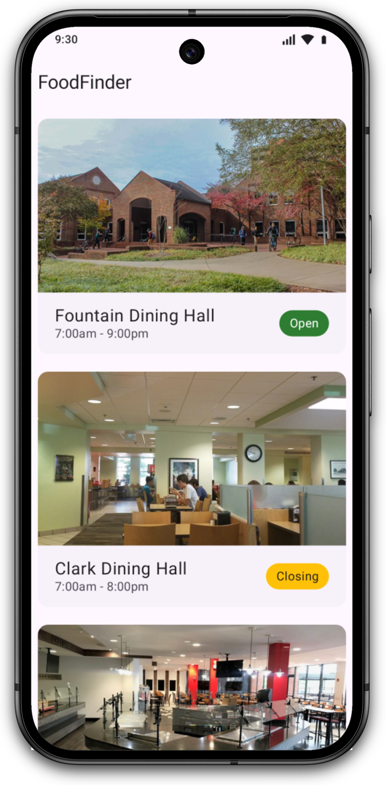
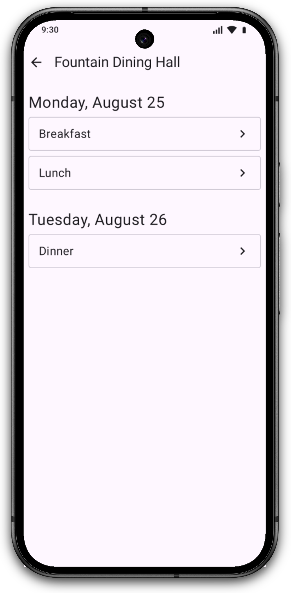
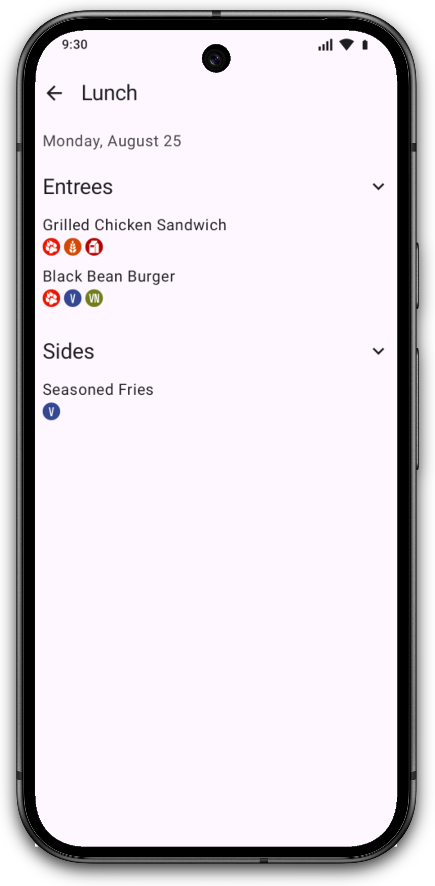

# FoodFinder

An app for viewing NC State Dining menus and hours in one place.

## Screenshots

| Home                                                                                                                                                                                    | Menu List                                                                                                                                                                                              | Menu                                                                                                                                                                                    |
| --------------------------------------------------------------------------------------------------------------------------------------------------------------------------------------- | ------------------------------------------------------------------------------------------------------------------------------------------------------------------------------------------------------ | --------------------------------------------------------------------------------------------------------------------------------------------------------------------------------------- |
| <picture><source media="(prefers-color-scheme: dark)" srcset="android/screenshots/home-dark.png"></picture> | <picture><source media="(prefers-color-scheme: dark)" srcset="android/screenshots/menu-list-dark.png"></picture> | <picture><source media="(prefers-color-scheme: dark)" srcset="android/screenshots/menu-dark.png"></picture> |

## Why?

NC State Dining recently switched their menus to a new platform, [NetNutrition](https://netmenu2.cbord.com/NetNutrition/ncstate-dining). While the new site is functional, it means that hours and menus are in different places, and the new website suffers from UX issues. That's why we set out to build an app that was fast, streamlined, and personalizable &mdash; an app that gives you the information you need and gets out of your way.

## Features

- View NC State Dining locations with daily hours and location photos
  - Support for adjusted hours due to holidays or inclement weather
- Dining menus with dietary restriction information and relevant categories surfaced first
- Offline browsing after a menu has been downloaded once
- Speedy interface with caching and speculative loading of common pages
- Light/dark theme and Material You support

## Architecture

The FoodFinder backend is a Kotlin application that runs a Ktor web server and a scraper. The scraper runs once daily, collecting the dining menus from NetNutrition and the hours from the NC State Dining website. It stores those in a local H2 database (similar to SQLite). Then, it queries that database to respond to client requests.

When designing the backend, extra care was taken to be polite to the upstream data sources. The amount of simultaneous inflight requests is limited, and the data is fetched on a schedule rather than on-demand.

The frontend is an Android app built with Kotlin and Jetpack Compose. It fetches information as JSON from the backend and displays it in a nice user interface.

## Tech Stack

Android app:

- Kotlin
- Jetpack Compose, Compose Navigation
- Hilt (dependency injection)
- Retrofit + OkHttp (API client with HTTP caching), Coil (image loading)
- Detekt (static analysis)

Backend:

- Ktor (web server)
- H2 (flatfile database)
- Exposed (ORM)
- OkHttp (scraper HTTP client), Ksoup (HTML parsing)
- Quartz (scheduled jobs), kotlinx.serialization (JSON)
- Docker (containerization/deployment)

## API

Base URL (production): https://foodfinder-api.appdevncsu.org. Routes are defined in `backend/src/main/kotlin/org/appdevncsu/foodfinder/server/Server.kt`.

| Method | Path                                         | Query params                                            | Description                                                    |
| ------ | -------------------------------------------- | ------------------------------------------------------- | -------------------------------------------------------------- |
| `GET`  | `/api/locations`                             | —                                                       | List menu locations (`id`, `name`, `slug`, `type`, `imageUrl`) |
| `GET`  | `/api/locations/{slug}/image`                | —                                                       | Get a proxied/cached location photo                            |
| `GET`  | `/api/locations/{locationId}/menus`          | —                                                       | List upcoming menus for a location                             |
| `GET`  | `/api/locations/{locationId}/menus/{menuId}` | —                                                       | Get sections + items (with dietary `flags`) for one menu       |
| `GET`  | `/api/hours`                                 | `date=YYYY-MM-DD` (optional, defaults to today Eastern) | Hours for all dining locations on a date                       |

The API currently has no authorization mechanism. Feel free to use it for your own projects, as long as you set a distinct, custom `User-Agent` and respect the `Cache-Control` headers we set on our responses.

## Repository Structure

```
.
├── android/   # Android app (Kotlin, Jetpack Compose)
│   ├── app/src/main/  # UI, ViewModels, API client
└── backend/   # Ktor API server + scrapers (Kotlin/JVM)
    ├── src/main/kotlin/org/appdevncsu/foodfinder/
    │   ├── scraper/  # NetNutrition + dining.ncsu.edu scrapers
    │   ├── server/   # API routes, image proxy, daily-scrape scheduler
    │   └── shared/   # H2/Exposed database + data models
    ├── config/deploy.yml  # Kamal deploy config
    └── Dockerfile
```

## Development

### Prerequisites

- JDK 24 for the backend
- Android Studio (with JDK 21+) for the app
- Docker (optional, for running/deploying the backend container)

### Backend

```bash
cd backend
./gradlew shadowJar
java -jar build/libs/*-all.jar <command>
# or: ./gradlew run --args "<command>"
```

Available commands:

| Command           | Purpose                                                  |
| ----------------- | -------------------------------------------------------- |
| `scrape`          | Run the scraper once and exit                            |
| `serve`           | Run the API server on port 3000                          |
| `serve-scheduled` | Run the API server and scrape daily at 12am Eastern Time |

Persistent data (H2 database + image cache) lives in `$DATA_DIR`, defaulting to the working directory. The Docker image sets `DATA_DIR=/data` and exposes port 3000:

```bash
cd backend
docker build -t foodfinder-backend .
docker run -p 3000:3000 -v foodfinder_data:/data foodfinder-backend
# curl http://localhost:3000/api/locations
```

In production, we use Kamal (see `backend/config/deploy.yml`) to deploy to https://foodfinder-api.appdevncsu.org.

### Android app

Open `android/` in Android Studio and run the `app` configuration, or from the command line:

```bash
cd android
./gradlew assembleDebug
```

The app points at the production API (`https://foodfinder-api.appdevncsu.org` in `android/app/src/main/java/org/appdevncsu/foodfinder/data/APIClient.kt`) by default. For a signed release build, copy `android/keystore.properties.example` to `android/keystore.properties` and fill in the values (or set the `RELEASE_STORE_*` / `RELEASE_KEY_*` env vars).

### Lint

The Android app uses [Detekt](https://detekt.dev/) for linting with Compose rules.
It's configured in `android/detekt.yml`, and you can run it locally like this:

```bash
cd android
./gradlew detekt
```

## Credits

FoodFinder was developed from Fall 2025 &mdash; Spring 2026 by the Android team of the [App Development Club at NC State](https://appdevncsu.org):

- Brendan Swanson
- Dylan Lester
- Daniel Flores Elizondo
- Jonathan Duran-Ortiz
- Gauri Subash
- Venkat Vulava

## Disclaimer

This is not an official NC State University project. It is not affiliated with NC State University or Illumia (formerly Transact + CBORD, the company behind NetNutrition).

All information displayed in the app is publicly available online, and is gathered freely without bypassing any protection measures.
